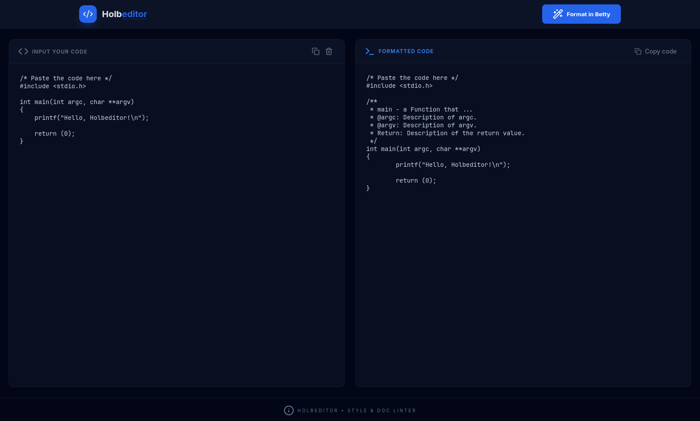

# Holbeditor

A web-based C code formatter built around the [Betty](https://github.com/alx-tools/Betty) style standard. Paste your C code, hit the button, get back clean, Betty-compliant output — no CLI required.

   

---



---

## What it does

- **Formats C code** to Betty style in one click
- **Side-by-side editor** — input on the left, formatted output on the right
- **Error reporting** — surfaces Betty lint errors directly in the UI
- **Copy-to-clipboard** for both the input and formatted output
- **Loading states** so you know the formatter is running

---

## Project structure

```
holbeditor/
├── backend/
│   ├── app.py            # Flask API (format + status endpoints)
│   └── requirements.txt  # Python dependencies
└── frontend/
    ├── index.html        # App shell
    ├── script.js         # Vanilla JS — API calls and UI logic
    ├── style.css         # Dark theme with CSS custom properties
    └── App.jsx           # React alternative implementation
```

---

## Getting started

### Prerequisites

- Python 3.8+
- [`bettyfixer`](https://github.com/alx-tools/Betty) installed and available on your `PATH`

### 1. Start the backend

```bash
cd backend
pip install -r requirements.txt
python app.py
```

The API will be available at `http://localhost:5000`.

### 2. Open the frontend

The frontend is plain HTML — no build step needed. Open `frontend/index.html` directly in a browser, or serve it with any static file server:

```bash
# Python one-liner
python -m http.server 8080 --directory frontend
```

Then visit `http://localhost:8080`.

---

## API reference

### `POST /format`

Formats a C source file through `bettyfixer`.

**Request body**
```json
{
  "code": "int main(void)\n{\n    return (0);\n}\n"
}
```

**Response**
```json
{
  "original_code": "...",
  "formatted_code": "...",
  "errors": "..."
}
```

| Field            | Type            | Description                              |
|------------------|-----------------|------------------------------------------|
| `original_code`  | string          | The code as submitted                    |
| `formatted_code` | string          | Betty-formatted output                   |
| `errors`         | string or null  | Stderr from `bettyfixer`, if any         |

**Status codes:** `200 OK` · `400 Bad Request` (missing `code`) · `500 Internal Server Error`

---

### `GET /status`

Health check.

```json
{ "status": "running" }
```

---

## Configuration

| Location            | Variable    | Default                         | Description              |
|---------------------|-------------|---------------------------------|--------------------------|
| `frontend/script.js` | `API_URL`  | `http://localhost:5000/format`  | Backend endpoint         |
| `backend/app.py`    | `port`      | `5000`                          | Flask server port        |
| `backend/app.py`    | `debug`     | `True`                          | Flask debug mode         |

---

## Tech stack

| Layer    | Technology              |
|----------|-------------------------|
| Backend  | Python, Flask, bettyfixer |
| Frontend | HTML5, CSS3, Vanilla JS |
| Icons    | Lucide                  |

---

## How it works

1. The user pastes C code into the input panel and clicks **Format in Betty**.
2. The frontend sends a `POST /format` request with the raw code as JSON.
3. The backend writes the code to a temporary `.c` file, runs `bettyfixer` on it as a subprocess, reads the modified file back, and returns the result.
4. The temporary file is deleted in the `finally` block regardless of success or failure.
5. The formatted code (and any lint errors) appears in the output panel.
